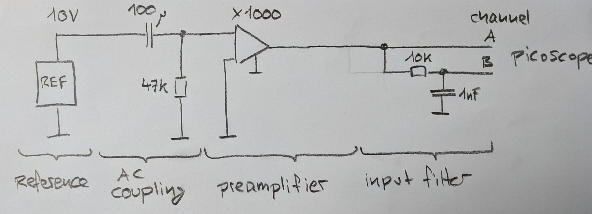

# DRAFT

# pymeas2019

## Highlights

* Measures noise from 56 MHz down to very low frequencies. Just start a measurement and observe lower frequencies apearing. Stop the measurement when you are satisfied. (in comparison: with other instruments you have to choose a time window, then you wait until the time is over and then you see what you got. Playing around at low frequencies this is very inefficient and boring.)
* Frequency points have equally distance in logaritmic scale: 12 bins in one decade for example. You get diagrams over a many decades of frequency. (in coparison: normally the frequency spacing is constant, 1 Hz for example. At high frequencies the bin size is very small and the noise corresponding high. Useless presentation if you show data, especially if you show data in logaritmic scale.)
* Presentation as LSD, PSD, LS or PS.
* Cheap setup, around 1000 USD for the oscilloscope.

## Installation

- Picoscope Oscilloscope SW

- Picoscope Application - SDK: This is NOT required
- pip install -r requirements.txt
- Pymeas2019_noise
  - `git clone --recurse-submodules https://github.com/nanopysics/pymeas2019_noise.git`
- Start measurement
  - `cd pymeas2019_noise\measurement-actual`
  - `run_2_composite_plot_interactive.bat`
  - start

## Directory structure

- `<TOPDIR>` The directory containing the file `TOPDIR.TXT`
  - `<TOPDIR>\measurement-actual` \
    The results of the actual measurement. \
    If the measurements are done, the directory may be moved away.

    - `config_measurement.py` \
      configuration within the file. \
      The results will be placed in a subfolder `raw-blue-2020-01-18_20-30-22`. \
      You may copy and rename this folder but you have to preserve `raw-<color>-<topic>`.

    - `run_1_condense.bat` \
      This will loop over all `raw-xxx` directories and create `result_xxx` files.

    - `run_2_plot_composite.py` \
      You may still run this script when the folder is moved away. \
      This will loop over all `raw-xxx` directories and read `raw-xxx\result_summary.pickle`.
      Diagrams will be created.

## Usecase: Measuring the Noise of a voltage-reference

A voltage reference has 10V at the output. An AC coupling network only passes higher frequencies to a preamplifier. After the noise is amplified, it passes to channel A and trough an input filter to channel B. The input filter is used as an antialiasing filter because we sample slow at input B. Channel A is sampled at 125 MHz without bandwith limitation and 62.5 MHz with build in bandwith limitation at 20 MHz.
This setup is useful to characterize the noise between 0.1 Hz and 100 kHz for example.


You need
* voltage referece
* AC coupler
* preamplifier (for example preamplifier_noise_2020)
* input filter channel B
* picoscope PS5442D
* windows 10, python ... and pymeas2019_noise install according to former chapter

Check the function of all stages, use the picoscope SW provides by picoscope to see the singal at input A and input B. Short the input of the AC coupling stage. Can you see the decrease of noise? Choose a range, 1V for example, where no overload occures.

We start with a measurement of the shortet AC coupling stage.

change config_measurement.py
```
inputRange=program_picoscope.InputRange.R_1V,
duration_slow_s=1*3600.0, # maximum time
skalierungsfaktor=1.0E-3 # -> gain of the preamplifier
```

doubleclick run_2_composite_plot_interactive.py


ckick start

give name 'short' as the input of the AC coupling stage is shorted.
give color 'green'.


start

after one minute on cmd window stop with control c...?


Now we connect the reference voltage to the AC coupling stage.

start
give name 'reference XY'
give color 'red'
start


* you can see 1/f region of the reference noise
* you can see the white noise region of the reference noise.
* some peaks: 50 Hz, 150 Hz and 250 Hz
* the background noise of the measuring setup 'short' is well below the noise measurement. If this would not be the case the background noise has an influence on the result. To be able to compare these values it is important to measure the background noise with exactly the same settings as the measurement itself.
* at 100kHz the amplifier has a built in low pass

start again
rename folder
delete folder
restart animate

Now, as this measurement is done, you can copy the folder measurement-actual to an other place.
To measurement_ref_XYZ for example. Here you can keep your measurement.

You can delete all files with a filenames starting with 'result_' and generate them again with run_2_composite_plots.py ??? 

you may optimize diagrams for your needs.
library_plot.py
Matplotlib commands here will act to all presentations.
```
  # Uncomment to set fix frequency axis
  # ax.set_xlim(1e-3, 1e7)
```

## Usecase: Measuring the Noise of two voltage-references


If you want to go to below 0.1 Hz with your measurement on easy trick is to measure the difference of two references. As long as the noise of the references is not correlated (and this is normally not the case) you can expect about sqrt(2) times the noise of a single reference.

And yes, the offset after the preamplifier should be low. You could adjust the offset by adjust one reference a bit for example.

the lowest frequency you can see is about 

f_lowest = 1 / (1.3 * aquisition_time)


