# pymeas2019

## Highlights

* Measures noise from 56 MHz down to very low frequencies. Just start a measurement and observe lower frequencies apearing over time. Stop the measurement when you are satisfied. (in comparison: with other instruments you have to choose a time window, then you wait until the time is over and then you see what you got. Playing around at low frequencies this is very inefficient and boring.)
* Measuring over many decades of frequency. (in comparison: this is normally not possible as the number of samples is limited to 10M for example. In addition: if you want to measure at a low frequency, you have to reduce the samplerate acordingly to get long aquisition time. Now, with the low samplerate, you get in trouble with the nyquist theorem. You need low frequency antialiasing filters: this can be very tricky.)
* Frequency points have equally distance in logaritmic scale: 12 bins in one decade for example. You get diagrams over a many decades of frequency. (in coparison: normally the frequency spacing is constant, 1 Hz for example. At high frequencies the bin size is very small and the noise corresponding high. Useless presentation if you show data, especially if you show data in logaritmic scale.)
* Presentation as LSD, PSD, LS or PS.
* Cheap setup, around 1000 USD for the oscilloscope.


## State of development
Alpha, no guarantee at all. 
We just developed for our needs, over some weekends and during long evenings.

## Installation

Tested on Windows 10, Windows 7 and with the versions shown below.

### Picoscope Oscilloscope SW
www.picotech.com/downloads
Windows PicoScope 6.14.10
SDK: This is NOT required

### python
we use:
https://www.python.org/downloads/release/python-372/
python 3.7.2 32 bit
Windows x86 executable installer
install using defaults

### git
https://git-scm.com/download/win
install using defaults

### install pymeas2019_noise
start `cmd.exe`

```
python -m pip install --upgrade pip
cd C:\data\temp        (for example, choose yourself)
git clone --recurse-submodules https://github.com/nanophysics/pymeas2019_noise.git
cd pymeas2019_noise
python -m pip install -r requirements.txt
```

restart pc

* file explorer: pymeas2019_noise/measurement-actual
* double click run_0_plot_interactive.bat`
click start

## Directory structure

- `<TOPDIR>` The directory containing the file `TOPDIR.TXT`
  - `<TOPDIR>\measurement-actual` \
    The results of the actual measurement. \
    If the measurements are done, the directory may be moved away.

    - `config_measurement.py` \
      configuration within the file. \
      The results will be placed in a subfolder `raw-blue-2020-01-18_20-30-22`. \
      You may copy and rename this folder but you have to preserve `raw-<color>-<topic>`.

    - `run_1_condense.bat` \
      This will loop over all `raw-xxx` directories and create `result_xxx` files.

    - `run_0_plot_interactive.bat` \
      You may still run this script when the folder is moved away. \
      This will loop over all `raw-xxx` directoriehttps://stackoverflow.com/jobs/companies?so_medium=StackOverflow&so_source=SiteNavs and read `raw-xxx\result_summary.pickle`.

## Usecase: Measure noise of a voltage-reference

A voltage reference has 10V at the output. An AC coupling network only passes higher frequencies to a preamplifier. After the noise is amplified, it passes to channel A and trough an input filter to channel B. The input filter is used as an antialiasing filter because we sample slow at input B. Channel A is sampled at 125 MHz without bandwith limitation and 62.5 MHz with build in bandwith limitation at 20 MHz.
This setup is useful to characterize the noise between 0.1 Hz and 100 kHz for example.

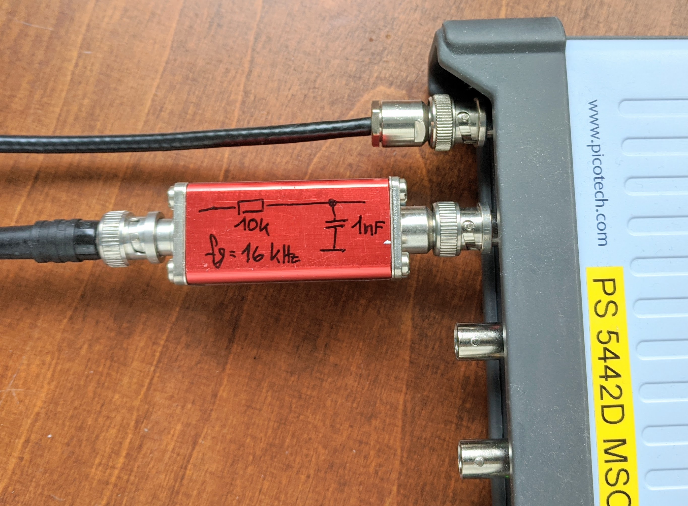

You need
* voltage referece
* AC coupler
* preamplifier (for example preamplifier_noise_2020)
* input filter channel B
* picoscope PS5442D
* windows 10, python ... and pymeas2019_noise install according to former chapter

Check the function of all stages, use the picoscope SW provides by picoscope to see the singal at input A and input B. Short the input of the AC coupling stage. Can you see the decrease of noise? Choose a range, 1V for example, where no overload occures.

We start with a measurement of the shortet AC coupling stage.

change config_measurement.py
```
inputRange=program_config_instrument_picoscope.InputRange.R_1V,
duration_slow_s=1*3600.0, # maximum time
skalierungsfaktor=1.0E-3 # -> gain of the preamplifier
```

doubleclick run_2_composite_plot_interactive.py

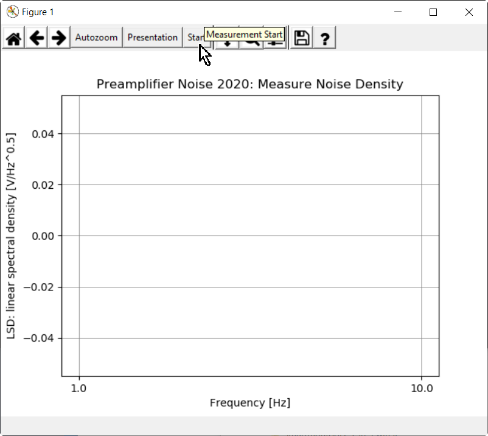

click start

give name 'short' as the input of the AC coupling stage is shorted.
give color 'green'.

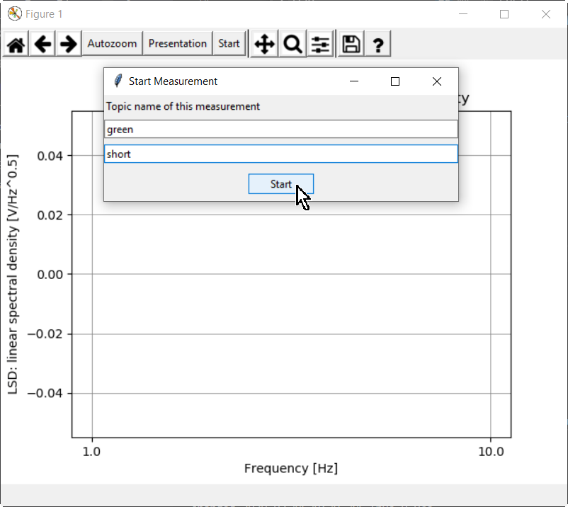

start

after one minute, cmd window, stop with ctrl-c.
Close the cmd window yourself.


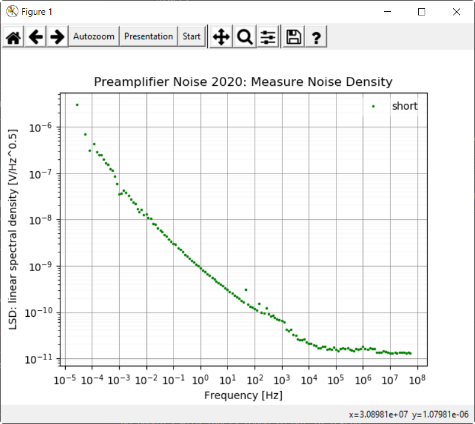

* you can see 1/f region (0.01 Hz to 1 Hz)
* you can see the white noise region (10 Hz to 10k Hz)
* some peaks: 50 Hz, 150 Hz and 250 Hz
* at 100kHz the amplifier has a built in low pass


Now we connect the reference voltage to the AC coupling stage.

start
give name 'reference XY'
give color 'red'
start

The background noise of the measuring setup 'short' is well below the noise measurement. If this would not be the case, the background noise would have an influence on the result. To be able to compare these values it is important to measure the background noise with exactly the same settings as the measurement itself.

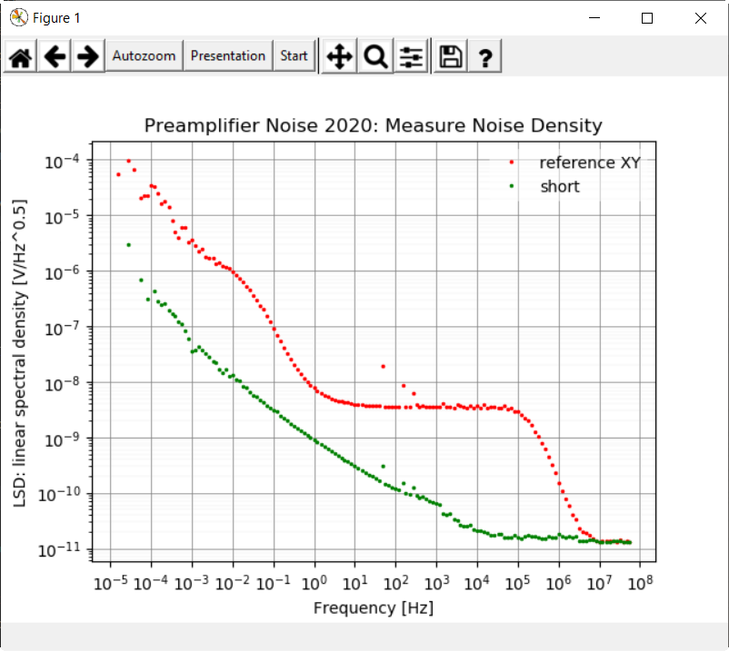


You could:
* start more measurements
* rename folders
* delete folders
* restart animate

Now, as this measurement is done, you can copy the folder measurement-actual to an other place.
To measurement_ref_XYZ for example. Here you can keep your measurement.

You can delete all files with a filenames starting with 'result_' and generate them again with run_2_composite_plots.py ??? 

You may optimize diagrams for your needs.

Matplotlib commands here will act to all presentations.

change library_plot.py
```
# Uncomment to modify figure
# self.fig.set_size_inches(13.0, 7.0)
ax.set_xlim(1e-1, 1e4)
# ax.set_ylim(1e-10, 1e-1)
```

restart run_0_plot_interactive.bat

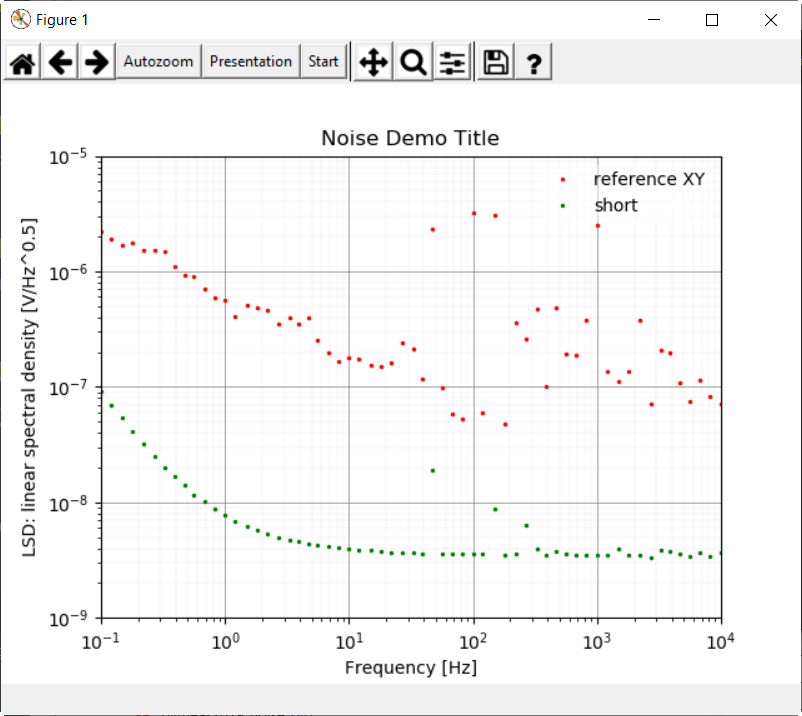

We see the useful range between 0.1 Hz and 1 Hz. The reference voltage noise is well above the 'short' noise. The measurement therefore is useful. A lot of 'dirt' is between 10 Hz and 1000 Hz.

We press the button 'Presentation' and choose LS: linear spectrum.

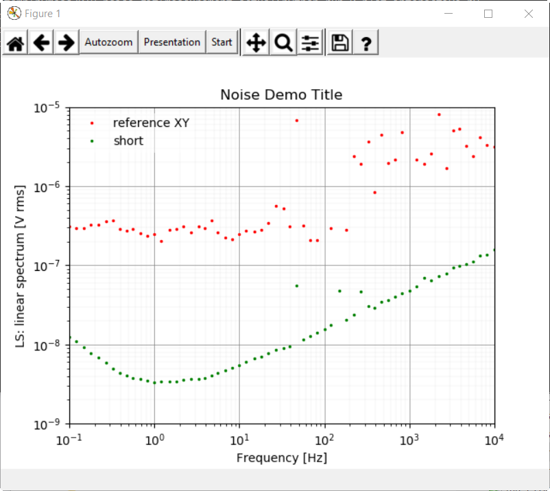

We move the curser to the point at 50 Hz

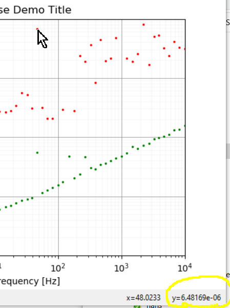

and can read the 50 Hz sinusoidal signal is about 7 uV rms. 
(if the signal is spread over multiple points its more complicate to measure the voltage...)

We press the button 'Presentation' and choose INTEGRAL.

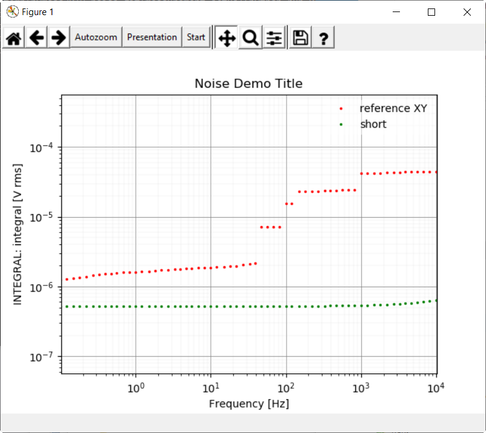

We now want to know the noise voltage in the range between 0.1Hz and 10kHz.
* At 0.1 Hz we have about 1.3 uV rms
* At 10 kHz we have about 43 uV rms
* We calculate the difference:
sqrt(43uV^2 - 1.3uV^2) = 43 uV rms (assuming we have only random noise what is not completely true)

## Usecase: Measuring the Noise of two voltage-references
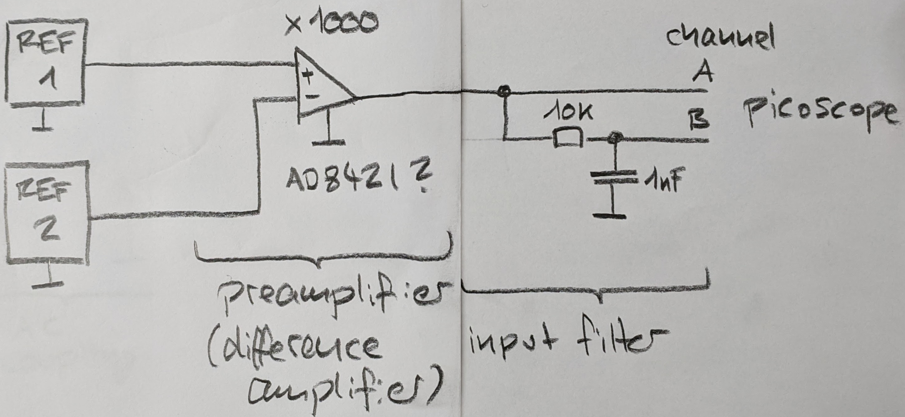

If you want to go to below 0.1 Hz with your measurement an easy trick is to measure the difference of two references. As long as the noise of the references is not correlated (and this is normally not the case as long as you do not have to much mains noise coupled to your setup) you can expect about sqrt(2) times the noise of a single reference.

And yes, the offset after the preamplifier should be low. You could adjust the offset by adjust one reference a bit for example.

the lowest frequency you can see is about 

f_lowest = 1 / (1.3 * aquisition_time)


## Noise Picoscope

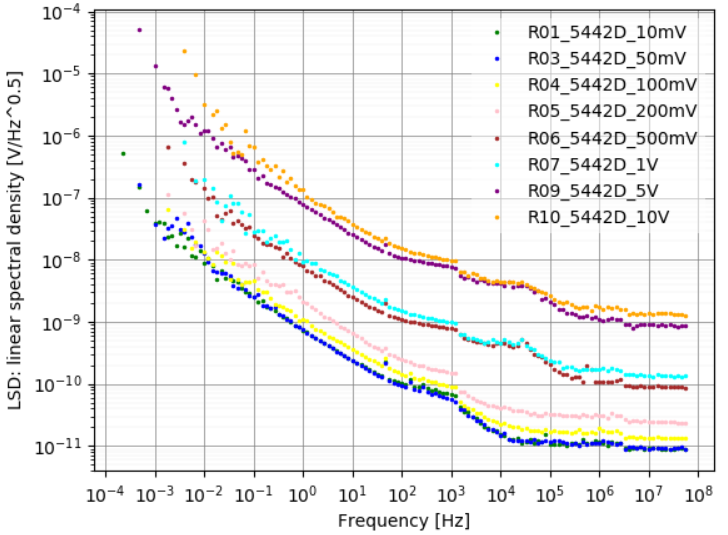

With a preamplifier with a gain of 1000 we measured this noise contribution of the picoscope. The noise level could be quite different from device to device.
The 100mV range shows about the same noise as the ranges below. Therefore you should use the 100mV range or above.

To geht the noise level at the oscilloscope input, multiply the values shown in the diagram by 1000.

The noise level of the picoscope is not overwhelming but for the price an size it's ok.

## Limitation
* Not perfect for signals above 30 MHz. There is no good antialiasing filter for the samplerates 62.5 MHz and 125 MHz. This can lead to spurious measurements if your signal contains frequencies above 30 MHz. Example: you have a sinusoidal signal at 61.5 MHz. Due to the missing antialiasing filter you will see a 1 MHz signal in your measurement: 62.5 MHz - 61.5 MHz = 1 MHz.