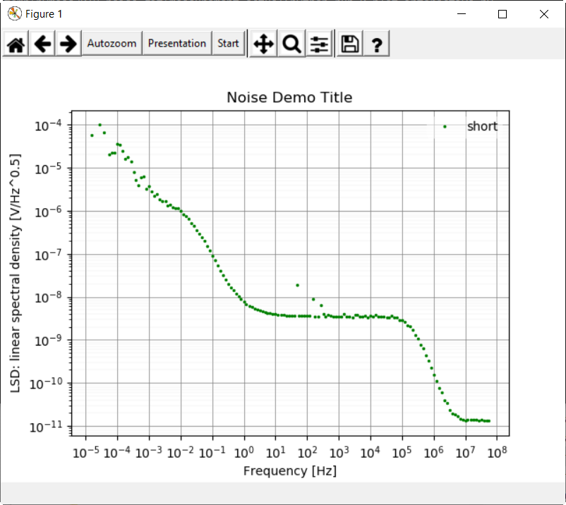
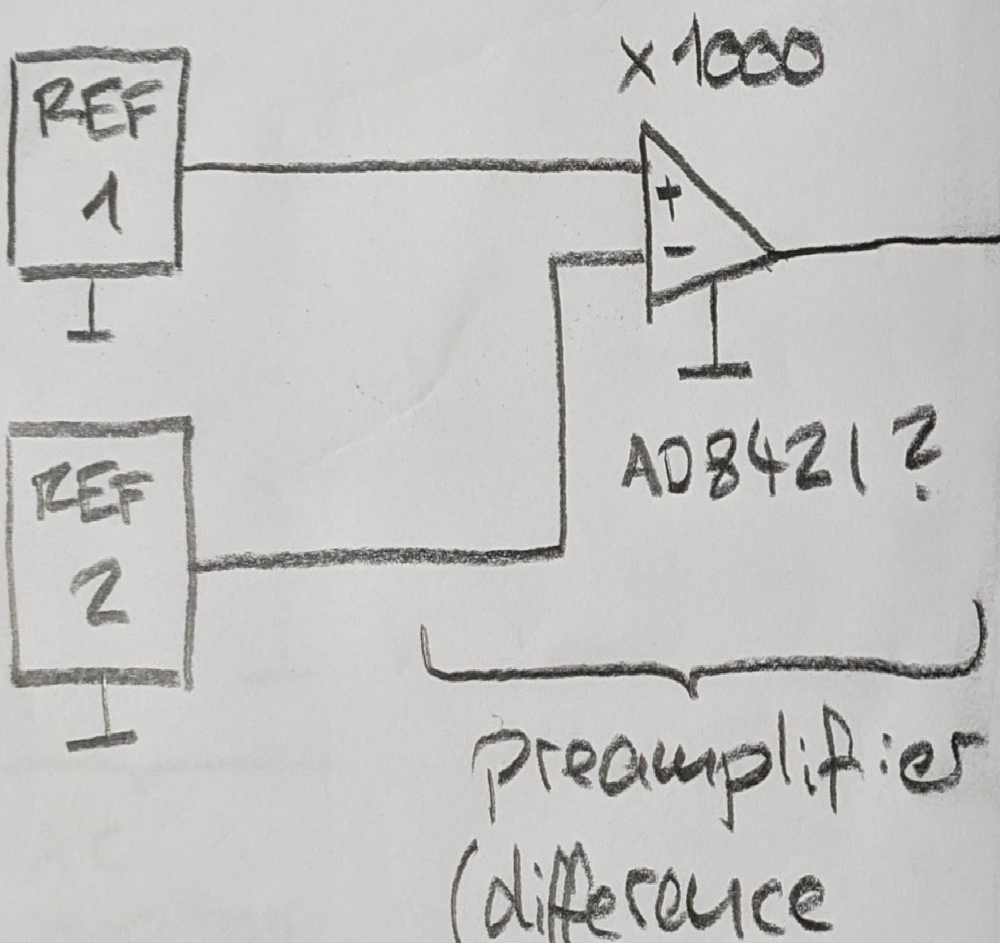

# pymeas2019
<span style="background-color: yellow; font-weight: bold;">Outdated!!! Will be reworked in July 2026.</span>

## Highlights

* Measures noise from 39 kHz down to very low frequencies. Just start a measurement and observe lower frequencies apearing over time. Stop the measurement when you are satisfied. (in comparison: with other instruments you have to choose a time window, then you wait until the time is over and then you see what you got. Playing around at low frequencies this is very inefficient and boring.)
* Measuring over many decades of frequency. (in comparison: this is normally not possible as the number of samples is limited to 10M for example. In addition: if you want to measure at a low frequency, you have to reduce the samplerate acordingly to get long aquisition time. Now, with the low samplerate, you get in trouble with the nyquist theorem. You need low frequency antialiasing filters: this can be very tricky.)
* Frequency points have equally distance in logaritmic scale: 12 bins in one decade for example. You get diagrams over a many decades of frequency. (in coparison: normally the frequency spacing is constant, 1 Hz for example. At high frequencies the bin size is very small and the noise corresponding high. Useless presentation if you show data, especially if you show data in logaritmic scale.)
* Presentation as LSD, PSD, LS or PS, Integral, Decade, Stepsize, Timeserie.
* Cheap setup, around 200 USD for the ad_low_noise_float_2023. This is the recomended analog to digital converter.


## State of development

Unstable: The application works perfectly for your needs.

## Installation

See

* [README_install_user.md](README_install_user.md)
* [README_install_developer.md](README_install_developer.md)


## Directory structure

- `measurement_actual\` \
  The results of the actual measurement. \
  If the measurements are done, the directory may be moved away.

  - `config_measurement.py` \
    configuration within the file. \
    The results will be placed in a subfolder `raw-blue-2020-01-18_20-30-22`. \
    You may copy and rename this folder but you have to preserve `raw-<color>-<topic>`.

  - `run_1_condense.bat` \
    This will loop over all `raw-xxx` directories and create `result_xxx` files.

  - `run_0_gui.bat` \
    You may still run this script when the folder is moved away. \
    This will loop over all `raw-xxx` directoriehttps://stackoverflow.com/jobs/companies?so_medium=StackOverflow&so_source=SiteNavs and read `raw-xxx\result_summary.pickle`.

## Usecase: Measure noise of a voltage-reference


A voltage reference has 10V at the output (DUR, device under test). An AC coupling network only passes higher frequencies to the AD converter. A switch let you choose between the signal and a short to gnd.


You need
* voltage referece
* AC coupler
* ad_low_noise_float_2023
* windows 10 or 11
* pymeas2019_noise installed

We start with a measurement of the shortet AC coupling stage.

change config_measurement.py
```
inputRange=program_config_instrument_picoscope.InputRange.R_1V,
duration_slow_s=1*3600.0, # maximum time
skalierungsfaktor=1.0E-3 # -> gain of the preamplifier
(!!! outdated -> Peter todo !!!)
```

doubleclick run_0_gui.bat


click start

give name 'short' as the input of the AC coupling stage is shorted.
give color 'green'.


(!!! outdated -> Peter todo !!!)

start

after one minute, cmd window, stop with ctrl-c.
Close the cmd window yourself.



(!!! outdated -> Peter todo !!!)

* you can see 1/f region (0.01 Hz to 1 Hz)
* you can see the white noise region (10 Hz to 10k Hz)
* some peaks: 50 Hz, 150 Hz and 250 Hz
* at 100kHz the amplifier has a built in low pass


Now we set the switch to measure the noise.

start
give name 'reference XY'
give color 'red'
start

The background noise of the measuring setup 'short' is well below the noise measurement. If this would not be the case, the background noise would have an influence on the result. To be able to compare these values it is important to measure the background noise with exactly the same settings as the measurement itself.


(!!! outdated -> Peter todo !!!)

You could:
* start more measurements
* rename folders
* delete folders
* restart animate

Now, as this measurement is done, you can copy the folder measurement_actual to an other place.
To measurement_ref_XYZ for example. Here you can keep your measurement.

You can delete all files with a filenames starting with 'result_' and generate them again with run_2_composite_plots.py ??? 

You may optimize diagrams for your needs.

Matplotlib commands here will act to all presentations.

change library_plot.py
```
# Uncomment to modify figure
# self.fig.set_size_inches(13.0, 7.0)
ax.set_xlim(1e-1, 1e4)
# ax.set_ylim(1e-10, 1e-1)
```

restart run_0_gui.bat


We see the useful range between 0.1 Hz and 1 Hz. The reference voltage noise is well above the 'short' noise. The measurement therefore is useful. A lot of 'dirt' is between 10 Hz and 1000 Hz.

We press the button 'Presentation' and choose LS: linear spectrum.


We move the curser to the point at 50 Hz


and can read the 50 Hz sinusoidal signal is about 7 uV rms. 
(if the signal is spread over multiple points its more complicate to measure the voltage...)

We press the button 'Presentation' and choose INTEGRAL.


We now want to know the noise voltage in the range between 0.1Hz and 10kHz.
* At 0.1 Hz we have about 1.3 uV rms
* At 10 kHz we have about 43 uV rms
* We calculate the difference:
sqrt(43uV^2 - 1.3uV^2) = 43 uV rms (assuming we have only random noise what is not completely true)

We press the button 'Display' and choose STEPSIZE


We press the button 'Display' and choose TIMESERIE


We can see a swing into.

Settle of the input highpass filter
* Press Start to start a new measurement
* Press Stopp to stop the measurement
* Press Skip Settle to force the measurement to start even though the voltage may not have been settled 

Basenoise

If you name a measurement BASENOISE, this measurement represents the noise of the Setup. The BASENOISE is then substracted from the other measurements.


Example: You want to measure the noise of a voltage A. First, you measure the noise with the input of your amplifier shortet and you name this measurement BASENOISE. Then you connect the input of your amplifier to the voltage A. You name this measurement "voltage A". Now you can see the BASENOISE and voltage A - BASENOISE.

Take care: the noise of your setup depends on the input range of the picoscope. If you change the input range, you should repeat the BASENOISE measurement.
The BASENOISE should be significant lower than the noise you want to measure.

## Usecase: Measuring the Noise of two voltage-references


If you want to go to below 0.1 Hz with your measurement an easy trick is to measure the difference of two references. As long as the noise of the references is not correlated (and this is normally not the case as long as you do not have to much mains noise coupled to your setup) you can expect about sqrt(2) times the noise of a single reference.

And yes, the offset after the preamplifier should be low. You could adjust the offset by adjust one reference a bit for example.

the lowest frequency you can see is about 

f_lowest = 1 / (1.3 * aquisition_time)


